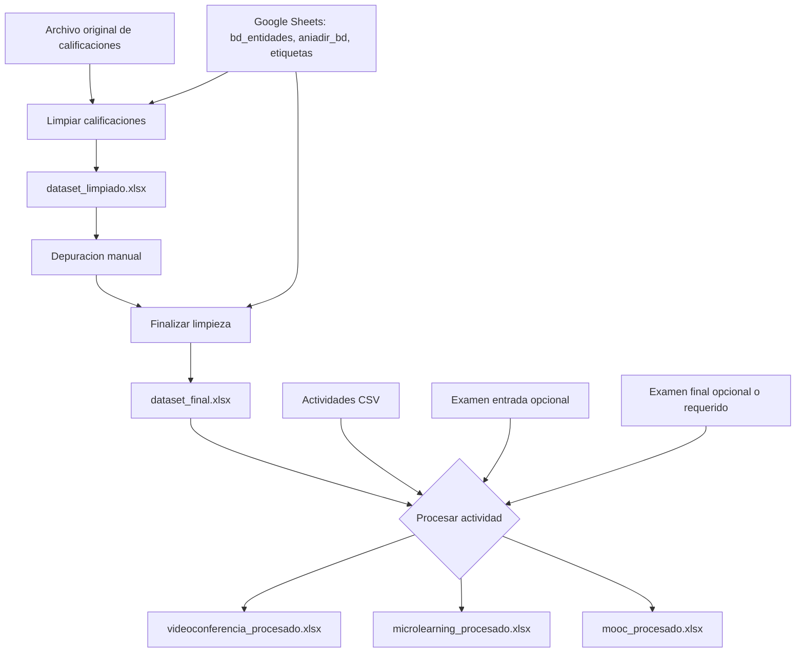

# Flujo de procesamiento

Este documento resume que funcion se ejecuta en cada parte del flujo del repo.
Hay tres etapas principales:

1. `Limpiar calificaciones`: genera `dataset_limpiado.xlsx`.
2. `Finalizar limpieza`: genera `dataset_final.xlsx`.
3. `Procesar actividad`: genera el archivo final de videoconferencia, microlearning o MOOC.

La app Streamlit usa `app.py` como entrada principal. Los scripts CLI usan los
mismos modulos `core`, por lo que la logica central es compartida.

## Mapa rapido

| Etapa | Entrada Streamlit | Entrada CLI | Funcion core principal | Salida |
|---|---|---|---|---|
| Limpiar calificaciones | `app.py::limpiar_calificaciones` | `app_procesamiento.preparar_calificaciones limpiar` o `app_procesamiento.limpiar_calificaciones` | `core.limpieza_calificaciones::limpiar_dataset_calificaciones` | `dataset_limpiado.xlsx` |
| Finalizar limpieza | `app.py::finalizar_calificaciones` | `app_procesamiento.preparar_calificaciones finalizar` o `app_procesamiento.finalizar_calificaciones` | `core.finalizacion_calificaciones::finalizar_dataset_calificaciones` | `dataset_final.xlsx` |
| Procesar actividad | `app.py::procesar_videoconferencia`, `procesar_microlearning`, `procesar_mooc` | `app_procesamiento.procesar_videoconferencia`, `procesar_microlearning`, `procesar_mooc` | `core.procesamiento_actividades::*_dataset` | `*_procesado.xlsx` |

## Diagrama general

## 1. Limpiar calificaciones

### Cuando se ejecuta

Se ejecuta al presionar la pestana `Limpiar calificaciones` en Streamlit o al
usar el modo CLI `preparar_calificaciones limpiar`.

### Secuencia desde Streamlit

1. `app.py::limpiar_calificaciones(uploaded_file, registrar_pendientes, cfg)`
2. `app.py::contexto_google(...)`
3. `app.py::sheets_service_from_secrets()`
4. `core.google_sheets::extract_spreadsheet_id(...)`
5. `app.py::cargar_bd_y_etiquetas(...)`
6. `core.entidades::cargar_bd_entidades(...)`
7. `core.entidades::cargar_etiquetas_entidad(...)`
8. `app.py::leer_excel(uploaded_file)`
9. `core.limpieza_calificaciones::limpiar_dataset_calificaciones(...)`
10. `app.py::descargar_excel(..., "dataset_limpiado.xlsx", ...)`

### Secuencia core

`limpiar_dataset_calificaciones(df, bd, etiquetas, ...)` ejecuta:

1. `core.limpieza_laboral::aplicar_reglas_limpieza_inicial(df, etiquetas)`
2. `core.limpieza_laboral::normalizar_nombre_entidad(...)`
3. Reglas iniciales sobre `situacion_laboral`, `tipo_entidad`, `ruc` y
   `nombre_entidad`.
4. `core.entidades::validar_ruc_para_match(df)`
5. `core.entidades::aplicar_match_por_ruc(df, bd, reset_match=True)`
6. `core.entidades::preparar_bd_para_match_por_ruc(bd)`
7. `core.entidades::normalizar_columnas_entidad(bd)`
8. Match por RUC contra `bd_entidades`; si hay match, actualiza
   `match_entidad`, `tipo_entidad`, `nivel_gobierno`, `nombre_entidad` y
   `situacion_laboral`.
9. `core.entidades::aplicar_match_por_nombre(df, bd)`
10. Match por `nombre_entidad` solo para filas sin match, con RUC vacio o `0`,
    y nombres unicos en la base.
11. `core.limpieza_laboral::aplicar_correcciones_post_match(df)`
12. Si `registrar_pendientes=True`:
    `core.entidades::registrar_pendientes_en_sheets(...)`.

### Resultado

Devuelve un dataframe depurado con matches preliminares y correcciones iniciales.
La salida esperada es `dataset_limpiado.xlsx`, que luego se revisa manualmente.

## 2. Finalizar limpieza

### Cuando se ejecuta

Se ejecuta despues de depurar manualmente `dataset_limpiado.xlsx`. En Streamlit
corresponde a la pestana `Finalizar limpieza`; en CLI corresponde al modo
`preparar_calificaciones finalizar`.

### Secuencia desde Streamlit

1. `app.py::finalizar_calificaciones(uploaded_file, cfg)`
2. `app.py::contexto_google(...)`
3. `core.entidades::cargar_bd_entidades(...)`
4. `app.py::leer_excel(uploaded_file)`
5. `core.finalizacion_calificaciones::finalizar_dataset_calificaciones(df, bd)`
6. `app.py::mostrar_errores_match_no(analisis_errores)`
7. `app.py::descargar_excel(..., "dataset_final.xlsx", ...)`

### Secuencia core

`finalizar_dataset_calificaciones(df, bd, ...)` ejecuta:

1. `core.entidades::validar_ruc_para_match(df)`
2. `core.entidades::aplicar_match_por_ruc(df, bd, reset_match=True)`
3. `core.entidades::aplicar_match_por_nombre(df, bd)`
4. `core.limpieza_laboral::normalizar_columnas_por_situacion_laboral(df)`
5. Reglas finales por `situacion_laboral`:
   - dependiente publico: completa campos que no corresponden y ajusta perfil
     vacio u otros segun RNP. Si `ruc = 0`,
     `nombre_entidad = "INDEPENDIENTE Y OTROS"` y `nivel_gobierno` esta vacio
     o es `-`, pone `nivel_gobierno = "No indica"`.
   - dependiente privado: pone `nivel_gobierno = "No corresponde"` y marca campos no
     aplicables como `No corresponde`.
   - trabajador independiente: pone `nivel_gobierno = "No corresponde"`,
     `nombre_entidad = "INDEPENDIENTE Y OTROS"` y normaliza perfil por RNP.
   - no labora actualmente: marca campos como `No corresponde` y
     `tipo_entidad = "No labora actualmente"`.
6. `core.finalizacion_calificaciones::normalizar_rubro_organizacion_calificaciones(df)`
7. `core.finalizacion_calificaciones::aplicar_reglas_finales(df)`
8. `core.errores_match_no::analizar_errores_match_no(df)`

### Reglas importantes de perfil por RNP

La normalizacion de perfil para entidades publicas esta en
`core.limpieza_laboral::normalizar_perfil_entidad_publica_por_rnp`:

| Condicion | Perfil asignado |
|---|---|
| `tipo_entidad == "Entidad pública"`, perfil vacio o generico, y `rnp` es `Si` | `PROVEEDOR` |
| `tipo_entidad == "Entidad pública"`, perfil vacio o generico, y `rnp` es `No` o `No indica` | `PROFESIONAL INDEPENDIENTE` |

La normalizacion de perfil para independientes esta en
`core.limpieza_laboral::normalizar_perfil_independiente_por_rnp`:

| Condicion | Perfil asignado |
|---|---|
| `situacion_laboral == "Trabajador independiente"` y `rnp` es `No` o `No indica` | `PROFESIONAL INDEPENDIENTE` |
| `situacion_laboral == "Trabajador independiente"` y `rnp` es `Si` | `PROVEEDOR` |

La normalizacion de perfil proveedor por tipo de entidad esta en
`core.limpieza_laboral::normalizar_perfil_proveedor_por_tipo_entidad_rnp`:

| Condicion | Perfil asignado |
|---|---|
| `tipo_entidad` es `Entidad privada` o `No labora actualmente`, y `rnp` es `Si` | `PROVEEDOR` |

### Resultado

Devuelve el dataframe consolidado y un analisis de filas con
`match_entidad = NO`. La salida esperada es `dataset_final.xlsx`.

## 3. Procesar actividad

### Cuando se ejecuta

Se ejecuta despues de tener `dataset_final.xlsx`. Esta etapa ya no consulta
Google Sheets para entidades: espera que el enriquecimiento de calificaciones
se haya hecho en las dos etapas anteriores.

### Secuencia comun desde Streamlit

1. El usuario elige `Videoconferencia`, `Microlearning` o `MOOC`.
2. `app.py` valida archivos obligatorios.
3. Al presionar `Procesar actividad`, llama a una de estas funciones:
   - `app.py::procesar_videoconferencia(...)`
   - `app.py::procesar_microlearning(...)`
   - `app.py::procesar_mooc(...)`
4. Cada wrapper ejecuta `core.diagnosticos::imprimir_diagnostico_duplicados_dni(...)`.
5. Cada wrapper lee archivos con:
   - `core.lectores::leer_actividades(...)`
   - `core.lectores::leer_calificados(...)`
   - `core.lectores::leer_examen(...)`, si aplica.
   - `core.lectores::leer_examen_final(...)`, si aplica.
6. Luego llama a la funcion dataset correspondiente en
   `core.procesamiento_actividades`.

### Secuencia comun core

Las tres ramas usan estas funciones base:

1. `core.transformaciones::unir_fuentes(calificados, actividades)`
2. `core.transformaciones::merge_por_dni_o_nombre(...)`
3. `core.columnas::eliminar_columnas_actividad(df, tipo_actividad)`
4. `core.transformaciones::eliminar_columnas_basura(df)`
5. `core.transformaciones::limpiar_campos_generales(df)`
6. `core.columnas::mover_columna_despues_de_otra(...)`
7. `core.transformaciones::eliminar_columnas_exportacion(df)`

`limpiar_campos_generales` centraliza normalizaciones transversales:

1. `normalizar_columna_rnp`
2. `formatear_fecha`
3. `normalizar_celular`
4. `normalizar_ruc`
5. `normalizar_carrera_tecnica`
6. `MAP_PERFIL`
7. `normalizar_region`
8. `normalizar_nivel_certificacion`
9. `normalizar_clasificacion_empresa`
10. `normalizar_perfil_entidad_publica_por_rnp`
11. `normalizar_perfil_independiente_por_rnp`
12. `normalizar_perfil_proveedor_por_tipo_entidad_rnp`
13. `normalizar_rubro_organizacion`

### Rama Videoconferencia

`procesar_videoconferencia_dataset(actividades, calificados)` ejecuta:

1. `unir_fuentes(calificados, actividades)`
2. `eliminar_columnas_actividad(df, "videoconferencia")`
3. `eliminar_columnas_basura(df)`
4. `limpiar_campos_generales(df)`
5. `core.certificados::calcular_condicion_y_constancia(df)`
6. `mover_columna_despues_de_otra(df, "clasificacion_empresa", "perfil")`
7. Ordena por `condicion` y `certificado`, si ambas columnas existen.
8. `eliminar_columnas_exportacion(df)`

### Rama Microlearning

`procesar_microlearning_dataset(actividades, calificados, examen_entrada, examen_final)` ejecuta:

1. `unir_fuentes(calificados, actividades)`
2. Si hay examen de entrada:
   `merge_por_dni_o_nombre(df, examen_entrada, "examen entrada")`
3. Si hay examen final:
   `merge_por_dni_o_nombre(df, examen_final, "examen final", suffixes=("", "_final"))`
4. `eliminar_columnas_actividad(df, "microlearning")`
5. `eliminar_columnas_basura(df)`
6. `limpiar_campos_generales(df)`
7. `core.columnas::convertir_columnas_calificacion(df)`
8. `core.columnas::ordenar_bloque_calificaciones(df)`
9. `core.columnas::ordenar_columnas_intermedias(df)`
10. `mover_columna_despues_de_otra(df, "clasificacion_empresa", "perfil")`
11. `core.columnas::ordenar_por_calificaciones(df)`
12. `core.certificados::agregar_certificado_por_total(df, crear_si_no_hay_total=False)`
13. `eliminar_columnas_exportacion(df)`

### Rama MOOC

`procesar_mooc_dataset(actividades, calificados, examen_entrada, examen_final)` ejecuta:

1. `unir_fuentes(calificados, actividades)`
2. Si hay examen de entrada:
   `merge_por_dni_o_nombre(df, examen_entrada, "examen entrada")`
3. Siempre hace merge con examen final:
   `merge_por_dni_o_nombre(df, examen_final, "examen final", suffixes=("", "_final"))`
4. `eliminar_columnas_actividad(df, "mooc")`
5. `eliminar_columnas_basura(df)`
6. `limpiar_campos_generales(df)`
7. `convertir_columnas_calificacion(df)`
8. `mover_columna_despues_de_otra(df, "clasificacion_empresa", "perfil")`
9. `mover_columna_despues_de_otra(df, "total_curso", "Calificación/20,00_final")`
10. `ordenar_bloque_calificaciones(df)`
11. `ordenar_por_calificaciones(df)`
12. `agregar_certificado_por_total(df, crear_si_no_hay_total=True)`
13. `eliminar_columnas_exportacion(df)`

## Diagrama de funciones core

## Notas de mantenimiento

- Las reglas de `situacion_laboral`, `tipo_entidad`, `rnp` y `perfil` viven
  principalmente en `app_procesamiento/core/limpieza_laboral.py`.
- Los matches contra la base de entidades viven en
  `app_procesamiento/core/entidades.py`.
- Las normalizaciones generales usadas al procesar actividades viven en
  `app_procesamiento/core/transformaciones.py`.
- El orden, eliminacion y conversion de columnas vive en
  `app_procesamiento/core/columnas.py`.
- Las reglas de condicion, constancia y certificado viven en
  `app_procesamiento/core/certificados.py`.
